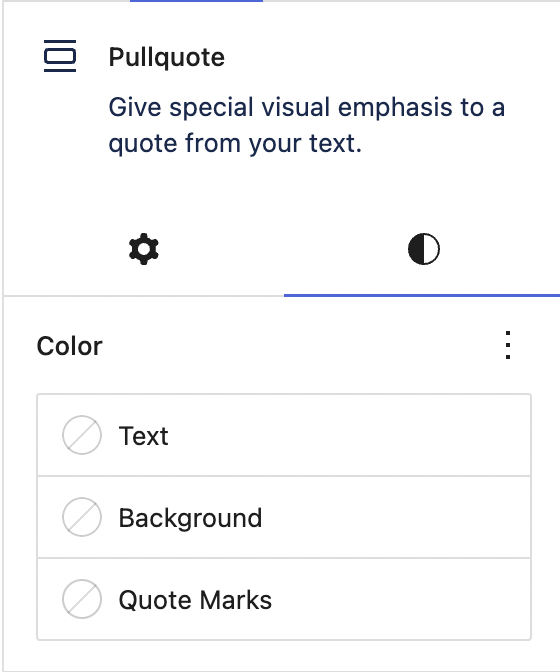

# Block Supports Extended

- Tested up to: 6.3
- License: GPL-2.0-or-later

Helpers for extending built in block support features such as color options.

## Description

To use the plugin you will need to activate it and then register your new block supports properties like so:

```php
Block_Supports_Extended\register( 'color', 'quoteMarks', [
	'label' => __( 'Quote Marks' ),
	// Properties are translated to what the setting value is applied to,
	// for example, text will give ".selector { color: value }". This is
	// the same as the options available for the "color" block.json.
	'property' => 'text',
	// %s is replaced with a generated class name applied to the block.
	'selector' => '.%1$s blockquote::before, .%1$s blockquote::after',
	// Optional list of default blocks to add support for. This can
	// also be done via a block's block.json "supports" property, or
	// later using the Block_Supports_Extended\add_support() function.
	'blocks' => [
		'core/pullquote',
	],
] );
```

This will have the effect of extending the core quote block's `block.json` like so:

```json
{
	"supports": {
		"color": {
			"quoteMarks": true
		}
	}
}
```

A "Quote Marks" option will be added to the default block colour settings. Everything else included CSS generation is then handled for you.



## Future Roadmap

Currently only the `color` feature is supported, but we will likely extend this to `typography`, `border` etc…

Depending on the future direction of WordPress core which promises to make the styles engine more pluggable we may continue extending this or keep it limited.

## Installation

This section describes how to install the plugin and get it working.

e.g.

1. Upload the plugin files to the `/wp-content/plugins/block-supports-extended` directory, or install the plugin through the WordPress plugins screen directly.
1. Activate the plugin through the 'Plugins' screen in WordPress

## Changelog

### 0.1.0
* Release
